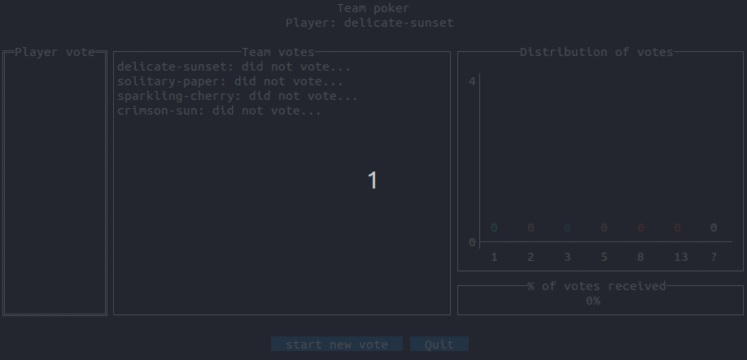

# poker

[](https://github.com/fc92/poker/actions/workflows/go.yml)
[](https://github.com/fc92/poker/actions/workflows/release.yaml)
[](https://goreportcard.com/report/github.com/fc92/poker)
[](https://codecov.io/github/fc92/poker)
[](https://pkg.go.dev/github.com/fc92/poker)
[](https://opensource.org/licenses/MIT)

## Game description

*poker* is a planing poker game **limiting vote influence** between the players. The goal is to collect an independent vote from each player and to improve the vote experience of distributed teams.

- vote progress is shared without showing vote values to avoid influence between players,
- only when vote is closed vote values are revealed and the vote distribution is displayed,
- players can join or leave at any time.



### Client console

Each player starts a console client to join the team server and play the game.

Client main features:

- [X] display available commands
- [X] allow mouse and keyboard user inputs
- [X] user defined or generated player name
- [X] commands: quit game, start new vote, send vote, modify vote, close the vote session
- [X] display vote progress during vote session
- [X] display distribution of votes when vote session is closed
- [X] content is driven by the server to maintain consistency between players

### Server

The server broadcasts a shared vision to all clients in real time.

Server main features:

- [X] start single game to host client players
- [X] share vote and available commands to all users
- [X] add connected user
- [X] remove disconnected user
- [X] broadcast vote status per user during vote session
- [X] broadcast votes when all votes are available or vote is manually closed
- [X] reset vote values when a new vote starts
- [X] close vote when all players have voted

## Usage

The same binary file is used to start the server and console clients. Various platform are supported. See [latest release page](https://github.com/fc92/poker/releases/latest) for more details.

Start a single server instance (dedicated for one team):

- using default websocket:

```bash
$ ./poker server
subcommand 'server'
  websocket: localhost:8080
```

- or specifying the websocket to open:

```bash
$ ./poker server -websocket 127.0.0.1:7878
subcommand 'server'
  websocket: 127.0.0.1:7878
```

When the server is started, start a client for each player. It must be able to communicate with the server.

- example of client specifying a player name and the websocket value:

```bash
$ ./poker client -name Player1 -websocket 127.0.0.1:7878
subcommand 'client'
  name: Player1
  server websocket: 127.0.0.1:7878
```

- example of client using a generated name and default websocket:

```bash
./poker client
subcommand 'client'
  name: snowy-cloud
  server websocket: localhost:8080
```

Each player can navigate the client console and send commands using keyboard and mouse.

## Information for developers

This section provides technical information for developers.

### High level design

HTTP websocket is used for "real-time" communication between clients and the server. Messages are in JSON format and contain `Room` and `Participant` information.

A server instance maintains a single `Room` that contains:

- a `Participant` for each player,
- the status of the game: vote open or closed.

The `Room` content changes when a client sends a command or is disconnected. Each change is broadcasted to all clients.

Each `Participant` contains information about a player:

- player name,
- commands available to the user,
- vote value.

A `Participant` can be updated by local user actions or updates sent from the server.

### Low level design

Server and console client are written in pure Go language.

The software is packaged as a single binary file for each supported platform. The same file is used with different parameters to start a server or a client instance from a text console.

It should be possible to write other client implementations using other languages supporting websocket and JSON.

Default websocket is `localhost:8080` when the value is not provided on the command line.
